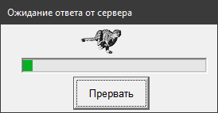

=====================================
Введение. Установка. Примеры программ
=====================================

Введение
========

Пакет ``snakecat`` представляет легкую обертку над ``irbis64_client.dll`` на основе ``ctypes`` и предназначен для создания клиентских приложений для системы автоматизации библиотек ИРБИС64 на языке Python.

Успешно работает на 32-битных и 64-битных версиях операционных систем Windows, а именно: Windows Vista/7/8/10. Работа на других версиях Windows, а именно: Windows 95/98/ME/NT не гарантируется.

Поддерживается интерпретатор CPython версий, начиная с 3.6. Другие интерпретаторы, например, IronPython, не тестировались и работоспособность пакета под ними не гарантируется.

Поддерживаются сервер ИРБИС64, начиная с версии 2014. Более ранние версии сервера ИРБИС64 не тестировались и работоспособность пакета под ними не гарантируется.

Основные возможности пакета:

* Поиск и расформатирование записей.

* Создание и модификация записей, сохранение записей в базе данных на сервере.

* Работа с поисковым словарем: просмотр терминов и постингов.

* Администраторские функции: получение списка пользователей, его модификация, передача списка на сервер, создание и удаление баз данных.

Установка
=========

``snakecat`` загружен в централизованный репозиторий пакетов PyPI, поэтому можно установить его с помощью стандартного клиента ``pip``, входящего в поставку Python:

::

  pip install snakecat --user --upgrade

Здесь ``--user`` означает установку только для текущего пользователя (без этого ключа установка будет выполняться для всех пользователей и может потребовать администраторских прав), а ``--upgrade`` - обновление пакета при необходимости. Если уже установлена последняя версия пакета, то ``pip`` просто сообщит об этом и завершит работу.

Также можно установить пакет, скачав необходимые файлы с репозитория GitHub: https://github.com/amironov73/snakecat

Кроме того, доступны ночные dist-сборки на AppVeyor: https://ci.appveyor.com/project/AlexeyMironov/snakecat/build/artifacts

Режимы работы клиента
=====================

``irbis64_client.dll`` имеет несколько режимов работы.

Во-первых, клиент может обращаться к серверу по нативному протоколу ИРБИС64 (этот режим используется по умолчанию) либо через Web-шлюз (этот режим включается вызовом ``IC_set_webserver(1)``).

Во-вторых, по умолчанию клиент использует асинхронный режим сокетов, не блокируя прокачку оконных событий. При возникновении задержки ответа сервера отображается окно с бегущим ирбисом

Для неинтерактивных скриптов такое поведение нежелательно, поэтому клиент можно переключить в блокирующий режим сокетов c помощью вызова ``IC_set_blocksocket(1)``.

**Заметьте, переключение режима клиента должно выполняться до выполнения подключения к серверу!**

Примеры программ
================

Ниже прилагается пример простой программы. В каталог находятся и загружаются 10 первых библиографических записей, в которых автором является А. С. Пушкин. Показано нахождение значения поля с заданным тегом и подполя с заданным кодом. Также показано расформатирование записи в формат ``brief``.

.. code-block:: python

    import sys
    import snakecat as irbis

    # Устанавливаем блокирующий режим сокета,
    # чтобы не появлялось ненужное окно
    irbis.hide_window()

    # данные для подключения к серверу
    HOST = '127.0.0.1'
    PORT = '6666'
    ARM = 'C'
    USER = 'librarian'
    PASSWORD = 'secret'
    DB = 'IBIS'

    # Подключение к серверу
    rc, ini = irbis.connect(HOST, PORT, ARM, USER, PASSWORD)
    print('connect=', rc)
    if rc < 0:
        print(irbis.error_to_string(rc))
        print('EXIT')
        sys.exit(1)

    # Поиск записей
    print()
    _, found = irbis.search(DB, '"K=ПУШКИН$"')
    print('Найдено записей:', len(found))

    # Чтобы не распечатывать все найденные записи, отберем только 10 первых
    for mfn in found[:10]:

        # Получаем запись из базы данных
        _, record = irbis.read_record(DB, mfn)
        title = irbis.fm(record, 200, 'a')
        print('Заглавие:', title)

        # Форматирование записи
        _, description = irbis.format_record(DB, mfn, '@brief')
        print('Биб. описание:', description)

        print()  # Добавляем пустую строку

    # Отключение от сервера
    print()
    rc = irbis.disconnect(USER)
    print('disconnect=', rc)
